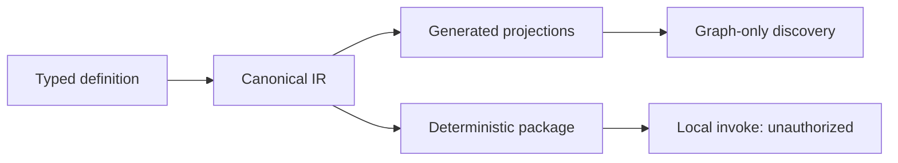

# Connector SDK reference

This page separates the interface implemented in the current private prototype from the work planned for the first public SDK release. Package names are publication candidates until a version is released publicly.

## Prototype package map

| Package | Current role | Public availability |
| --- | --- | --- |
| `@hands/connector-sdk` | Connector, action, authentication, schema, and skill-registration authoring API | Not published |
| `@hands/connector-protocol` | Shared protocol and profile contracts | Not published |
| `@hands/connector-compiler` | Canonical compilation | Not published |
| `@hands/connector-projections` | Generated projections for supported consumers | Not published |
| `@hands/connector-packager` | Deterministic unsigned package outputs | Not published |
| `@hands/connector-cli` | `hands-connector` command-line interface | Not published |
| `@hands/skill-registration-loader` | Skill Registration IR loading | Not published |
| Runtime bridge | Private compatibility and execution boundary | Remains private |

There is no evidence of a public npm release. The monorepo root and runtime bridge are private.

## Implemented authoring exports

The current SDK source exports:

- `defineConnector`
- `defineQueryAction`
- `defineMutationAction`
- `defineDestructiveAction`
- `defineNoAuth`
- `defineApiKeyAuth`
- `defineOAuth2`
- `defineSkillRegistration`
- `schema`

Implemented schema helpers cover `string`, `integer`, `number`, `boolean`, `literal`, `enum`, `array`, `object`, `optional`, `nullable`, and `json`.

Exact TypeScript signatures and examples will be published from the released source. They are intentionally not reconstructed from partial documentation here.

## Implemented protocol profiles

- `native-static-v1`
- `remote-mcp-v1`
- `native-static-v0` for compatibility

Implemented authentication declarations:

- no authentication;
- API key;
- OAuth 2.0 authorization code with PKCE.

Basic, bearer, and brokered authentication are not implemented public features.

Current action operations are query, mutation, and destructive. Declared request methods cover `GET`, `POST`, `PUT`, `PATCH`, and `DELETE`.

The current import policy permits the connector SDK and project-relative modules and rejects path escape. It is partial: complete dependency-policy enforcement and policy for Node globals remain open work. Current generated projections are also partial; configuration, documentation, and policy-review projections are not complete public behavior.

The current handler context contains only `connectorId`, `actionId`, and `requestMapping`. A mediated HTTP context and broader identity, readiness, revoke, pagination, and provider-error helpers are planned.

## Implemented CLI surface

```text
hands-connector <validate|generate|pack|invoke> [action] \
  [--input JSON] [--project DIR] [--json]
```

Only `validate`, `generate`, `pack`, and `invoke` are part of the current prototype. A local invocation reports local-project mode and `execution_authorized=false`; it is not a production permission grant.

## Demonstrated pipeline



The current prototype generates a manifest, Runtime requirement, catalog, action ownership, capability graph, projection index, bundled executable module, exact lock, SPDX 2.3 SBOM, provenance request, and unsigned package candidate. It has produced byte-identical unsigned package outputs on consecutive local runs. This is internal development evidence, not a claim that a public supply-chain or admission service is operating. The package candidate cannot sign, admit, activate, or grant production authority.

## Not yet implemented as public SDK behavior

- project initialization, scaffolding, and diagnostics;
- lint, test, development-server, fixture-recording, diff, and migration workflows;
- publish, promotion, and admission evidence workflows;
- Basic, bearer, or brokered authentication;
- identity, readiness, and revoke builders;
- pagination and provider-error helpers;
- a capability-limited mediated HTTP context;
- an isolated Package ABI host;
- public testkit, emulator, conformance, and project-generator packages;
- a proven never-before-known connector lifecycle against an unchanged production core.

## Compatibility promise

The first public release will document exact package, protocol, schema, and profile versions. Compatibility will be evidence-based and scoped; passing local validation will never imply marketplace acceptance, runtime authorization, or production Router onboarding.
